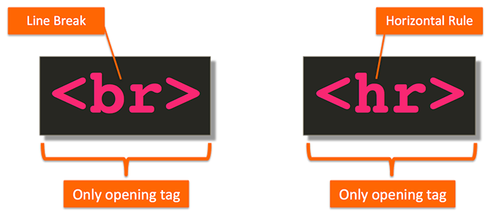
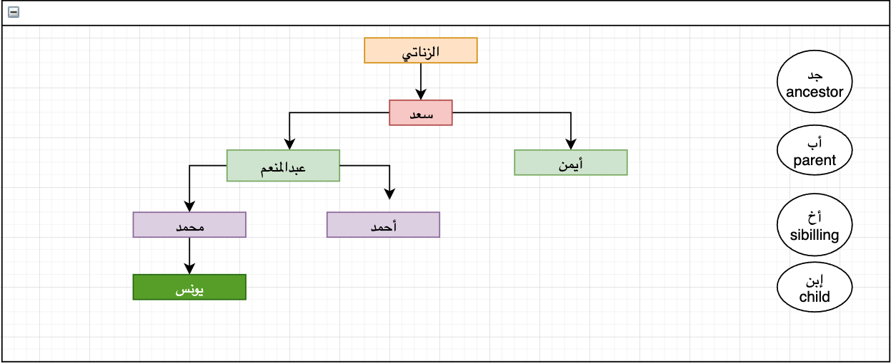
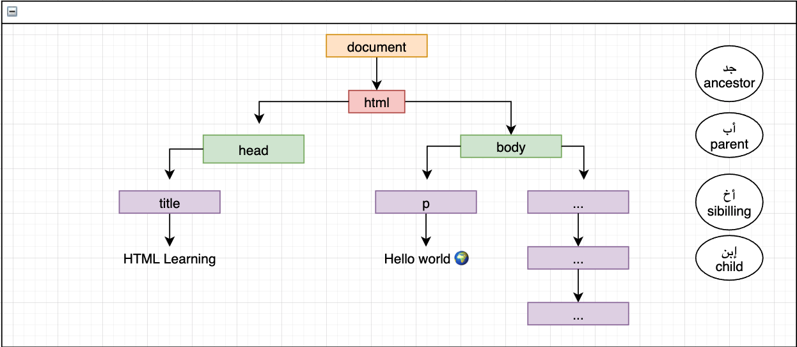
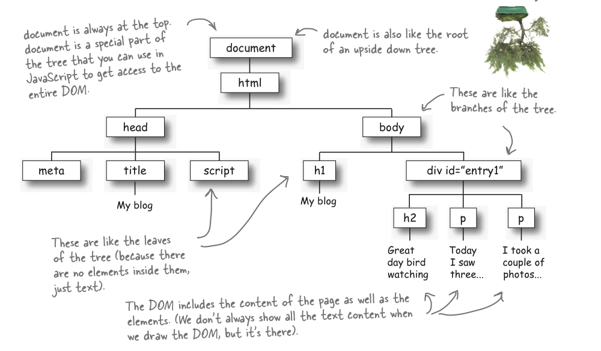
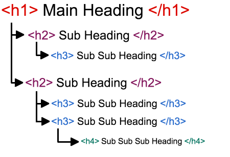

<iframe width="100%" height="600" src="https://www.youtube.com/embed/rytA8dLsSV8" title="YouTube video player" frameborder="0" allow="accelerometer; autoplay; clipboard-write; encrypted-media; gyroscope; picture-in-picture" allowfullscreen></iframe>

## What is HTML?

As [Wikipedia](https://en.wikipedia.org/wiki/HTML) mentioned it's HyperText Markup Language, or HTML is the standard markup language for documents designed
to be displayed in a web browser. It can be assisted by technologies such as Cascading Style Sheets and scripting languages such as JavaScript.

## Tools

There's many tools you can use over the years. I usesd most of the popular ones like [atom](https://atom.io/), [brackets](https://brackets.io/), [sublime text](https://www.sublimetext.com/download), [web storm](https://www.jetbrains.com/webstorm/)etc... but I finally fall in luv with
[vscode](https://code.visualstudio.com/) so i will use it in this course and here's [the code editor setup](https://www.youtube.com/watch?v=ykA7WnUQuV0&t=1s)
which has my favorite extensions but the most important ones for now is [prettier](https://marketplace.visualstudio.com/items?itemName=esbenp.prettier-vscode) which we
will use for formating and [liveserver](https://marketplace.visualstudio.com/items?itemName=ritwickdey.LiveServer) to avoid wasting time for re-loading every change we will make

## How does the internet Works

The [Internet](https://www.cloudflare.com/learning/network-layer/how-does-the-internet-work/) is the backbone of the Web, the technical infrastructure that makes the Web possible. At its most basic, the Internet is a large network of computers which communicate all together.

[Read More](https://developer.mozilla.org/en-US/docs/Learn/Common_questions/How_does_the_Internet_work)

- Brwoser is an application on your computer or phone that render
  all the code into the visuable webpages in the interent, the browser render all the code
- but the code restored on the server u can think of the server as a speical type of the computer
  whose main role is to talke with the browser and give them the code to give the ability to render the code
  you want to view w server can be in different computer sizes starting from your own computer all the way to large scale
  data ware houses like this from google
- the way client get all the code from the server is by a protocol called HTTP
- u need to be aware that everytime you hit the server to get more information like image, file anything it will make another http request
- too many http request and your website become slow
- sometimes the website we build is using databases

## HTML Philosophy

Create a new folder, create file with name `index.html` and open folder in VSCode


**Come On and Tag Along!**  😁

Since HTML is a tag-based language, 
it’s no surprise that at the core of HTML is the HTML tag. Let’s look at the syntax of an HTML tag.

Usually, an HTML tag consists of an opening and a closing tag that surrounds some content, 
marking up or annotating that content as shown below.


In this case, the tag p, which stands for paragraph, 
is communicating to us that the content in the gray area should be treated as a paragraph.


**Permitted Content**

Most HTML tags have a closing tag. As you just saw, the opening tag `<p>` has a closing tag `</p>`.
However, not all of them do. For example, as shown below, the `<br>` and `<hr>` tags 
only have an opening tag (br stands for line break, and hr stands for horizontal rule). They don’t have a closing tag at all.



In fact, the following code snippet would be invalid HTML:

```html
<br>Some content</br>
```

The reason? The `<br>` tag tells the browser to create a line break in text, 
i.e., anything that comes after the `<br>` tag should be displayed on the next line. 
It would never make sense for the `<br>` tag to surround some content and therefore it’s not allowed to.

The story is similar with the `<hr>` tag. The [linked MDN page](https://developer.mozilla.org/en-US/docs/Web/HTML/Element/hr) 
describes its Permitted content as None, it is an empty element.

> the above snippet coppied from [Anaomy of an HTML tag](https://clearlydecoded.com/anatomy-of-html-tag)


**&lt;!DOCTYPE html&gt;**

All HTML documents must start with a `<!DOCTYPE>` declaration. The declaration is not an HTML tag.
  It is an "information" to the browser about what document type to expect.

In HTML 5, the declaration is simple:

```html
<!DOCTYPE html>
```

In older documents (HTML 4 or XHTML),
the declaration is more complicated because the declaration must refer to a DTD (Document Type Definition).

```html
<!-- HTML 4.01 -->
<!DOCTYPE html PUBLIC "-//W3C//DTD HTML 4.01 Transitional//EN" "http://www.w3.org/TR/html4/loose.dtd">
```

**&lt;!DOCTYPE html&gt;**

- `<html></html>` The `<html>` tag represents the root of an HTML document. and it's is a container for all other HTML elements

<Tip>Note: You should always include the lang attribute inside the &lt;html&gt; tag, 
  to declare the language of the Web page. This is meant to assist search engines and browsers.</Tip>

**&lt;head&gt;**

the `<head>` is just a container for metadata and for sure we will know it later

**&lt;title&gt;**

The title of the page

**&lt;body&gt;**

contains all the contents of an HTML document, such as headings, paragraphs, images, hyperlinks, tables, lists, etc.

## DOM

The [DOM](https://www.w3.org/TR/WD-DOM/introduction.html) is stand for Document Object Model and it define the structure of documents and the way document is accessed

let's make it simple with anatomy of my name 



so now if we anotate this to HTML we will find something like 




The dom is not the code you writing, it's the final output in your browser



## Formatting Code

One thing you need to know about browser is that they ignore white spaces in HTML, CSS code so

```text
<!DOCTYPE html><html lang="en"><head><title>Hello World</title></head><body></body></html>
```

same exactly as

```html
<!DOCTYPE html>
<html lang="en">
  <head>
    <title>Hello World</title>
  </head>

  <body></body>
</html>
```

in the browser but It's important to keep quality high when writing code.
In reality, I'm super `lazy` 😂 and want the machine to do as much work as possible
so I can focus more on architecture and problem-solving and less on syntax and style.
While there are many tools that can help you keep code quality high.

`Prettier` has a few configurations but it's mostly meant to be a tool everyone uses and doesn't argue/bikeshed about the various code style rules. Here they are. I just use it as is since I'm lazy.

`Prettier` is great to use with [Visual Studio Code](https://code.visualstudio.com/). Just download this [extension](https://marketplace.visualstudio.com/items?itemName=esbenp.prettier-vscode) .

<Tip>
  set it to only run Prettier when it detects a Prettier config file. Makes it
  so you never have to turn it off. In order to do that, set{" "}
  <strong>prettier.requireConfig</strong> to true and{" "}
  <strong>editor.formatOnSave</strong> to true.
</Tip>


## The Head Tag

The `<head>` [element](https://developer.mozilla.org/en-US/docs/Learn/HTML/Introduction_to_HTML/The_head_metadata_in_HTML)
is a container for metadata (data about data). `Metadata` is data about the HTML document. **Metadata is not displayed**.

```html
<head>
  <!-- 
      The title element defines the title of the document.  
      The title must be text-only, and it is shown in the browser's title bar or in the page's tab.
  -->
  <title>A Meaningful Page Title</title>
  <!-- This element specifies the document's character encoding -->
  <meta charset="UTF-8" />
  <!-- Define a description of your web page -->
  <meta name="description" content="Free Web tutorials" />
  <!-- Define keywords for search engines -->
  <meta name="keywords" content="HTML, CSS, JavaScript" />
  <!-- Define the author of a page -->
  <meta name="author" content="John Doe" />
  <!-- Setting the viewport to make your website look good on all devices -->
  <meta name="viewport" content="width=device-width, initial-scale=1.0" />
</head>
```

[Specifying your document's character encoding](https://developer.mozilla.org/en-US/docs/Learn/HTML/Introduction_to_HTML/The_head_metadata_in_HTML#specifying_your_documents_character_encoding)
In the example we saw above, this line was included:

```html
<meta charset="utf-8" />
```

This element specifies the document's character encoding —
the character set that the document is permitted to use.
`utf-8` is a universal character set that includes pretty much
any character from any human language.
This means that your web page will be able to handle displaying any language; it's
therefore a good idea to set this on every web page you create!
For example, your page could handle English and Japanese just fine:


If you set your character encoding to `ISO-8859-1`,
for example (the character set for the Latin alphabet), your page rendering may appear all messed up:


## Text

### Headings

HTML headings are defined with the `<h1>` to `<h6>` tags. Each HTML page should only contain only **one** `h1` element we use these leveles to make hierarchy for the page as next image

[](https://www.nomensa.com/blog/how-structure-headings-web-accessibility)

```html
<h1>Heading 1</h1>
<h2>Heading 2</h2>
<h3>Heading 3</h3>
<h4>Heading 4</h4>
<h5>Heading 5</h5>
<h6>Heading 6</h6>
```

The `<h1>` element appears on the page when loaded in the browser — generally this should be used once per page, to mark up the title of your page content (the story title, or news headline, or whatever is appropriate to your usage.)
The `<title>` element is metadata that represents the title of the overall HTML document (not the document's content.)

### Paragraphs

- A [paragraph](https://www.w3schools.com/html/html_paragraphs.asp) always starts on a new line, and is usually a block of text. The HTML `<p>` element defines a paragraph.

- A [paragraph](https://www.w3schools.com/html/html_paragraphs.asp) always starts on a new line, and browsers automatically add some white space (a margin) before and after a paragraph.

```html
<p>This is a paragraph.</p>
<p>This is another paragraph.</p>
```

#### HTML Horizontal Rules

The `<hr>` tag defines a thematic break in an HTML page,
and is most often displayed as a horizontal rule. always used to separate content

```html
<h1>This is heading 1</h1>
<p>This is some text.</p>
<hr />
<h2>This is heading 2</h2>
<p>This is some other text.</p>
<hr />
```

#### HTML Line Breaks

The HTML `<br>` element defines a line break.

Use `<br>` if you want a line break (a new line) without starting a new paragraph:

```html
<p>This is<br />a paragraph<br />with line breaks.</p>
```

### Emphasizes and Italic

[By default](https://www.geeksforgeeks.org/difference-between-i-and-em-tag-of-html/#:~:text=By%20default%2C%20the%20visual%20result,show%20alternative%20mood%20or%20voice.), the visual result is the same. The main difference between these two tag is
that the `<em>` tag **semantically emphasizes on the important word or section of words**
while `<i>` tag is **just offset text conventionally styled in italic** to show alternative mood or voice.

### Emphasizes and Bold

[By default](https://www.geeksforgeeks.org/difference-between-strong-and-bold-tag-in-html/#:~:text=The%20text%20written%20under%20%3Cb,bold%20presentationally%20to%20draw%20attention.&text=The%20main%20difference%20between%20these,text%20conventionally%20styled%20in%20bold.),
The text written under `<b>` tag makes **the text bold presentationally to draw attention**.
The main difference between these two tag is that the `<strong>` tag **semantically emphasizes on the important word or section of words**
while the bold tag is just offset text conventionally styled in bold.


## Block and Inline Elements

Every HTML element has a default display value, depending on what type of element it is.

There are two display values: block and inline.

### Block-level Elements

- always starts on a new line
- takes up the full width available 
- has a top and a bottom margin

Here are the block-level elements in HTML:

```plaintext
<address> <article>   <aside>     <blockquote>  <canvas>  <dd>  <div>     <dl>    <dt>

<fieldset>  <figcaption>    <figure>  <footer>      <form>    <h1>-<h6>   <header>

<hr>    <li>      <main>  <nav>   <noscript>  <ol>  <p> <pre> <section> <table>     <tfoot>   <ul>      <video>
```

### Inline Elements

- **not** start on a new line.
- element only takes up as much width as necessary.
- **not** has a top and a bottom margin

Here are the inline-level elements in HTML:

```plaintext
<a> <abbr>  <acronym> <b> <bdo> <big> <br>    <button>    <cite>    <code>

<dfn> <em>  <i>  <input> <kbd> <label> <map> <object>  <output>  <q>

<samp>  <script>  <select>  <small> <span>  <strong>  <sub> <sup> <textarea>  <time>< tt> <var>
```

The `<div>` element is a block-level and is often used as a container for other HTML elements

The `<span>` element is an inline container used to mark up a part of a text, or a part of a document

### Inline Block Elements

it's hybrid type of elements which act as `inline` elements with the characteristecs of `block` element i mean i can set to 
the element `height` `padding`, etc... and there's two elements act as `inline-block` 

**img** element, **button** element

## Hyperlinks

[HTML links](https://www.w3schools.com/html/html_links.asp) are hyperlinks.
You can click on a link and jump to another document. When you move the mouse over a link,
the mouse arrow will turn into a little hand.

The HTML `<a>` tag defines a hyperlink. It has the following syntax:

```html
<a href="url">link text</a>
```

The most important attribute of the `<a>` element is the `href` attribute which stands for hypertext reference,
which indicates the link's destination.

### Absolute URLs vs. Relative URLs

The [main difference](https://www.seoquake.com/blog/relative-or-absolute-urls/) between absolute and relative paths is that absolute URLs always include the domain name of the site with http://www. Relative links show the path to the file or refer to the file itself.

A relative URL is useful within a site to transfer a user from point to point within the same domain.

Absolute links are good when you want to send the user to a page that is outside of your server.

```html
<h2>Absolute URLs</h2>
<p><a href="https://www.google.com/">Google</a></p>

<h2>Relative URLs</h2>
+<!-- A local link (a link to a page within the same website) is specified with a relative URL -->
<p><a href="/css/style.css">HTML Images</a></p>
```

### Target Attribute

By default, the linked page will be displayed in the current browser window. To change this,
you must specify another target for the link.

The target attribute specifies where to open the linked document.

The target attribute can have one of the following values:

`_self` **Default**. Opens the document in the same window/tab as it was clicked

`_blank` Opens the document in a new window or tab

`_parent` Opens the document in the parent frame

`_top` Opens the document in the full body of the window

```html
+
<!-- the most used one -->
<a href="https://www.google.com/" target="_blank">Visit Google! _blank</a>
```

### Link to an Email Address

Use `mailto:` inside the `href` attribute to create a link that opens the user's email program

```html
<a href="mailto:mohammedelzanaty129@gmail.com">Send email</a>
```

### Link Titles

The `title` attribute specifies extra information about an element.

```html
<a href="https://www.google.com/" title="Go to Google Website">Google</a>
```

### Link Download

The `download` attribute help us to download the target element.

```html
<a href="images/avatar.png" download>avatar</a>
```

### Link Fragment

Fragment happen when we give paragraph `id` and give it's path to `<a>` as

```html
<a href="#fragment">about me</a>

<p id="fragment">
  Lorem ipsum dolor sit amet consectetur adipisicing elit. Quae,
</p>
```

## Images

The `` [HTML element](https://developer.mozilla.org/en-US/docs/Web/HTML/Element/img) embeds an image into the document.

```html

```

The above example shows usage of the `` element:

The `src` attribute is required, and contains the path to the image you want to embed.

The `alt` attribute holds a text description of the image, which isn't mandatory but is **incredibly useful**
for accessibility — `screen readers` read this description out to their users so they know what the image means. Alt text is also displayed on the page if the image can't be loaded for some reason: for example, network errors, content blocking, or linkrot.

There are many other attributes to achieve various purposes:

- Use both width and height to set the intrinsic size of the image,
  allowing it to take up space before it loads, to mitigate content layout shifts.

- Responsive image hints with sizes and srcset (see also the
  [picture](https://developer.mozilla.org/en-US/docs/Web/HTML/Element/picture) element and
  [MDN Responsive](https://developer.mozilla.org/en-US/docs/Learn/HTML/Multimedia_and_embedding/Responsive_images) images tutorial).

## Video and Audio

### Video 

The HTML `<video>` element is used to show a video on a web page.

```html
<video width="320" height="240" autoplay muted loop>
  <source src="movie.mp4" type="video/mp4">
  <source src="movie.ogg" type="video/ogg">
Your browser does not support the video tag.
</video>
```

### Audio 

The HTML `<audio>` element is used to play an audio file on a web page.


```html
<audio controls autoplay muted>
  <source src="horse.ogg" type="audio/ogg">
  <source src="horse.mp3" type="audio/mpeg">
Your browser does not support the audio element.
</audio>
```

The `controls` attribute adds video controls, like play, pause, and volume.

It is a good idea to always include width and height attributes. 
If height and width are not set, the page might flicker while the video loads.

The `<source>` element allows you to specify alternative video files which the browser may choose from. 
The browser will use the first recognized format.

The text between the `<video>` and `</video>` tags will only be displayed in browsers that do not support 
the `<video>` element.

To start a video automatically, use the `autoplay` attribute

Add `muted` after `autoplay` to let your video start playing automatically (but muted)

To loop the video we need to add `loop` attribute

## Lists

[HTML lists](https://www.w3schools.com/html/html_lists.asp) allow to group a set of related items in lists.

There are three types of lists in `HTML`

### Unordered List

An unordered list starts with the `<ul>` tag. **Each list item starts with the `<li>` tag.**

```html
<ul>
  <li>Coffee</li>
  <li>Tea</li>
  <li>Milk</li>
</ul>
```

### Ordered List

An ordered list starts with the `<ol>` tag. **Each list item starts with the `<li>` tag**

```html
<ol>
  <li>Coffee</li>
  <li>Tea</li>
  <li>Milk</li>
</ol>
```

### Description List

A description list is a list of terms, with a description of each term.
The `<dl>` tag defines the description list, the `<dt>` tag defines the term (name), and the `<dd>` tag describes each term:

```html
<dl>
  <dt>Coffee</dt>
  <dd>- black hot drink</dd>
  <dt>Milk</dt>
  <dd>- white cold drink</dd>
</dl>
```

## Tables

HTML tables give you the ability to arrage your data into `rows` and `columns` and representing It as a tabular data

<Info>
  in old days we use it for layout pages but these days it's consider as a bad
  practice
</Info>

A table in HTML consists of table cells inside rows and columns

```html
<table>
  +
  <!-- Each table row starts with a <tr> and it's stands for table row. -->
  <tr>
    +
    <!-- Sometimes you want your cells to be headers, in those cases use the <th> tag instead of the <td> tag -->
    <th>Name</th>
    <th>Country</th>
  </tr>
  <tr>
    +
    <!-- Each table cell is defined by a <td> and it's stands for table data. -->
    +
    <!-- Everything between <td> and </td> are the content of the table cell. -->
    <td>Mohammed Elzanaty</td>
    <td>Egypt</td>
  </tr>
</table>
```

HTML also provides the tables with the `<thead>`, `<tbody>`, `<tfoot>`, and `<caption>` elements. These additional elements are
useful for adding semantic value to your tables and for providing a place for separate CSS styling.

```html
<table>
  +
  <!-- caption is the first child of table -->
  +
  <caption>
    Table Title
  </caption>
  +
  <!-- thead is after caption -->
  +
  <thead>
    <!-- Each table row starts with a <tr> and it's stands for table row. -->
    <tr>
      <!-- Sometimes you want your cells to be headers, in those cases use the <th> tag instead of the <td> tag -->
      <th>Name</th>
      <th>Country</th>
    </tr>
    +
  </thead>
  +
  <!-- tbody is after thead -->
  +
  <tbody>
    <tr>
      <!-- Each table cell is defined by a <td> and it's stands for table data. -->
      <!-- Everything between <td> and </td> are the content of the table cell. -->
      <td>Mohammed Elzanaty</td>
      <td>Egypt</td>
    </tr>
    +
  </tbody>
  +
  <!-- tfoot can be placed before or after tbody, but not in a group of tbody. -->
  +
  <!-- Regardless where tfoot is in markup, it's rendered at the bottom. -->
  +
  <tfoot>
    +
    <tr>
      +
      <td>Footer content 1</td>
      +
      <td>Footer content 2</td>
      +
    </tr>
    +
  </tfoot>
</table>
```

## Forms

An HTML form is used to collect user input. The user input is most often sent to a server for processing.

```html
<form>
    <fieldset>
      <legend>Login form</legend>
        <label for="fname">First name:</label><br>
        <input type="text" id="fname" name="fname" value="John"><br>
        <label for="lname">Last name:</label><br>
        <input type="text" id="lname" name="lname" value="Doe"><br>
        <label for="email">Enter your email:</label><br>
        <input type="email" id="email" name="email"><br><br>

        <p>Choose your favorite Web language:</p>
        <input type="radio" id="html" name="fav_language" value="HTML">
        <label for="html">HTML</label><br>
        <input type="radio" id="css" name="fav_language" value="CSS">
        <label for="css">CSS</label><br>
        <input type="radio" id="javascript" name="fav_language" value="JavaScript">
        <label for="javascript">JavaScript</label> <br><br>

        <p>Choose your favorite vehicle:</p>
        <input type="checkbox" id="vehicle1" name="vehicle1" value="Bike">
        <label for="vehicle1"> I have a bike</label><br>
        <input type="checkbox" id="vehicle2" name="vehicle2" value="Car">
        <label for="vehicle2"> I have a car</label><br>
        <input type="checkbox" id="vehicle3" name="vehicle3" value="Boat">
        <label for="vehicle3"> I have a boat</label> <br><br>

        <label for="favcolor">Select your favorite color:</label><br>
        <input type="color" id="favcolor" name="favcolor"> <br><br>


        <label for="birthday">Birthday:</label><br>
        <input type="date" id="birthday" name="birthday"> <br><br>

        <label for="myfile">Select a file:</label><br>
        <input type="file" id="myfile" name="myfile"> <br><br>

        <p>Choose your favorite courity:</p><br />
        <input list="country" name="country" class="datalist-input" />
        <datalist id="country">
            <option value="Afghanistan" />
            <option value="Albania" />
            <option value="Algeria" />
            <option value="American Samoa" />
        </datalist> <br><br>

        <input type="submit" value="Submit">
    </fieldset>
  </form>
```


The HTML `<form>`  is a container for different types of input elements, such as: 
text fields, checkboxes, radio buttons, submit buttons, etc.

An `<input>`  element can be displayed in many ways, depending on the `type` attribute, it can be text, radio, checkbox, email, color, file

The `<label>` element is useful for screen-reader users, 
because the screen-reader will read out loud the label when the user focus on the input element.

The `<label>` element also help users who have difficulty clicking on very small regions 
(such as radio buttons or checkboxes) - 
because when the user clicks the text within the `<label>` element, it toggles the radio button/checkbox.

The `<input type="text">` defines a single-line input field for text input.

The `<input type="email">` is used for input fields that should contain an e-mail address.

The `<input type="radio">` defines a radio button. Radio buttons let a user select **ONE** of a limited number of choices

The `<input type="checkbox">` defines a checkbox. Checkboxes let a user select **ZERO or MORE** options of a limited number of choices.

The `<input type="date"`> is used for input fields that should contain a date.

The `<input type="color">` is used for input fields that should contain a color.

The `<input type="file">` defines a file-select field and a "Browse" button for file uploads.


## IFrames

[An HTML iframe](https://www.w3schools.com/html/html_iframe.asp) is used to display a web page within a web page.

```html
<iframe
  src="document.html"
  height="200"
  width="300"
  title="Iframe Example"
></iframe>
```

- The HTML `<iframe>` tag specifies an inline frame
- The src attribute defines the `URL` of the page to embed
- Always include a `title` attribute (for screen readers)
- The `height` and `width` attributes specifies the size of the iframe
- Use `border:none;` to remove the border around the iframe


## Entities

[HTML Entities](https://www.w3schools.com/html/html_entities.asp) is a reserved characters in HTML must be replaced with character entities.

Some characters are reserved in HTML. so If you use the less than (<) or greater than (>) signs in your text, the browser might mix them with tags.

for example if we need to render in the string `now <HTML /> seems easy` if we try to write this sentence as
html code the code editor will mix it up and understand it as a tag to because `<` or `>` is reserved characters
to sove this issue we use HTML Entities so the HTML will like

```html
now &lt;HTML/&gt; seems easy &copy;
```

the abole code will be

<p>now &lt;HTML/&gt; seems easy &copy;</p>

in simple words we can say `entity` is a piece of text that begin with `&` and ends with `;`

<Tip>
  Complete <a href="https://dev.w3.org/html5/html-author/charref">List</a> of
  them, Don't hesitate to take a look
</Tip>

## HTML Comment Tags

[HTML comments](https://www.w3schools.com/html/html_comments.asp) are not displayed in the browser, but they can help document your HTML source code.

```html
<!-- Write your comments here -->
```

## Semantic

Semantic elements = elements with a meaning. so **What are Semantic Elements?**

> A semantic element clearly describes its meaning to both the browser and the developer.

Examples of **non-semantic elements**: `<div>` and `<span>` - Tells nothing about its content.

Examples of **semantic elements**: `<nav>`, `<main>`, and `<section>` - Clearly defines its content.

```html
<!-- old -->
<div class="header"></div>
<div class="nav"></div>
<div class="section">
  <h2>Heading</h2>

  <p>I luv <span class="highlight">teaching</span></p>
  <p>I need to learn HTML at Learning Day</p>
  
</div>
<div class="footer"></div>

<!-- with semantic -->
<header></header>
<nav></nav>
<section>
  <h2>Heading</h3>
  <p>I luv <mark>teaching</mark></p>
  <p>I need to learn HTML at <time datetime="2021-09-14">Learning Day</time>.</p>
  <figure>
    
    <figcaption>Fig1. - Trulli, Puglia, Italy.</figcaption>
  </figure>
</section>
<footer></footer>
```

The `<figure>` tag specifies self-contained content, like illustrations, diagrams, photos, code listings, etc.

The `<figcaption>` tag defines a caption for a `<figure>` element. 
The `<figcaption>` element can be placed as the first or as the last child of a `<figure>` element.

The `` element defines the actual image/illustration. 

## Structuring a Web Page

Most of the webpages in the internet must contain basic three blocks which is `header`, `main`, `footer` that's a pretty common
structure, some times we have in the webpage a content that **not directly related** to the main content and we can use for this
`aside` element

```html
<!DOCTYPE html>
<html lang="en">
  <head>
    <meta charset="UTF-8" />
    <meta http-equiv="X-UA-Compatible" content="IE=edge" />
    <meta name="viewport" content="width=device-width, initial-scale=1.0" />
    <title>Document</title>
  </head>

  <body>
    <header>
      <nav>
        <ul>
          <li></li>
          <li></li>
          <li></li>
          <li></li>
        </ul>
      </nav>
    </header>
    <main>
      <section>
        <h2>Section 1</h2>
        <article></article>
        <article></article>
      </section>
      <section>
        <h2>Section 2</h2>
        <article></article>
        <article></article>
      </section>
    </main>
    <aside></aside>

    <footer>
      <nav>
        <ul></ul>
      </nav>
    </footer>
  </body>
</html>
```

The `main` tag defines the main content of the page. every page can have only one `main` element

the `header` tag define the header for the section

<Tip>
  You can have several &lt;header&gt; elements in one HTML document. However,
  &lt;header&gt; cannot be placed within a &lt;footer&gt;, &lt;address&gt; or
  another &lt;header&gt; element.
</Tip>

the `aside` tage used to reperesnt an element that in directly related to the other element

The `section` tag defines sections in a document, such as chapters, headers, footers, or any other sections of the document. ...

The `article` tag specifies independent, self-contained content.
An article should make sense on its own and it should be possible to distribute it independently from the rest of the site.

## Validating Web Pages

Most of the time when we writing code we made a lot of errors and spend a lot of time to find the issue in the code so what about a tool that help use to
validate the code for us and tell what's missing in this case **[HTML validator](https://validator.w3.org/)** become handy which checks the markup validity of Web documents in HTML, XHTML, SMIL, MathML, etc.

we can validat our code whith three ways

- By `URI` if we have already a URL for our site
- By `File Upload`
- By `Directly Input` our HTML

the next example will help you to understand more better how to validate your HTML code, let's assue the next snippet
will be the code we need to validate

```html
<!DOCTYPE html>
<html>
  <head>
    <title>Hello World</title>
  </head>

  <body>
    
    <label>first name</label>
    <input type="text" />
  </body>
</html>
```

1- Open [validator.w3.org](https://validator.w3.org/)

2- Select Validate by Direct Input

3- Paste your code and hit `check` button

4- you will see **2 issues** one marked as `error` and other marked as `warning` with the solution to fix


5- add `lang` attribute to html with `alt` attribute to img tag

6- hit `check` button again


7- **Repeat the last 6 Steps at every HTML code you have until your code be green without any errors** 😉🤷🏻‍♂️
